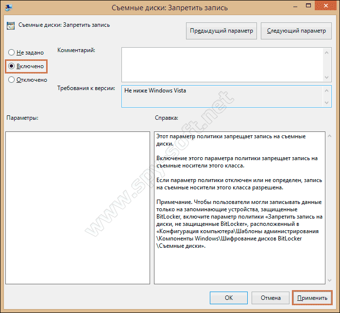

# Автоматизация - создание .bat файлов

## Как осуществить запуск нескольких программ сразу


### Термины для гугления

Список процессов cmd

Ключи процессов cmd

### КАК СОЗДАТЬ ПАКЕТНЫЙ ФАЙЛ

Краткий [видеокурс](https://www.youtube.com/watch?v=NvJdvjyFkLU) по .bat и командной строке (время просмотра - 1:17:23)

Здесь узнаём, какие команды писать в .bat файл и за что они отвечают

Открываем блокнот или Notepad++ и пишем такие строки:

```
@echo off
start "Firefox" "C:\Program Files\Mozilla Firefox\firefox.exe"
start "Notepad++" "C:\Program Files\Notepad++\notepad++.exe"
start "Photoshop" "C:\Program Files\Adobe\Adobe Photoshop CS5\Photoshop.exe"
```

где @echo off — обязательная первая команда, которая отключает вывод любых сообщений, а остальные три строки запускают Firefox, Notepad++ и Photoshop. Вы после команды «start» можете изменять название программы и её путь к исполняемому файлу на свои.



Путь к исполняемому файлу можно посмотреть и скопировать из поля «Объект:», после клика по ярлыку необходимого приложения правой кнопкой мышки и вызвав его свойства.

.png>)

Закончив формировать очерёдность запуска необходимых вам приложений в блокноте, переходим в меню «Файл» — «Сохранить как…», где пишем любое имя файла с расширением .BAT (в примере Start.bat), в поле «Тип файла:» выбираем «All types(\*.\*)» и указываем место расположения файла. В примере сохраняем как пакетный файл на Рабочем столе.

.png>)

### ЗАПУСК НЕСКОЛЬКИХ ПРОГРАММ

Запускаем нужные программы просто кликнув по файлу Start.bat на Рабочем столе.

.png>)

Как вариант, если вы хотите запускать выбранные приложения сразу после загрузки операционной системы автоматически, просто поместите созданный файл Start.bat в папку Автозагрузки («Пуск» — «Автозагрузка (правый клик — «Открыть»)» — переместить файл в открывшуюся папку).

.png>)

Но учтите, после проделанных действий, увеличивается и время загрузки операционной системы до полной её готовности с момента [включения компьютера](https://liwihelp.com/sistema/avtomaticheskoe_vklyuchenie_kompyutera.html), так как ей необходимо запустить дополнительно и выбранные вами программы! Спасибо за внимание дорогие читатели! Прошу не уходить сразу с этого блога, потому что для вас написано ещё около 500 полезных советов и инструкций!

[Главная](https://liwihelp.com) / [Система](https://liwihelp.com/category/sistema) / Как осуществить запуск нескольких программ сразу

### Рабочая директория


### Открытие файлов

Если вы в данный момент находитесь в командной строке и у вас есть файл с именем `test.png`and, который находится в нем, `c:\test`вы можете сделать следующее:

Если вы находитесь в каталоге (так следует сказать `c:\test>`), просто введите:

```
test.png
```

который откроет тест в редакторе изображений png по умолчанию.

Если имя файла содержит пробелы, просто заключите имя файла в ""

```
 "this image.png"
```

Вы также можете набрать:

```
c:\test\test.png
```

который откроет файл, где бы вы ни находились.

Наконец, вы можете передать изображение в другую программу. Например, если у вас есть редактор изображений с именем imageedit.exe и он поддерживает открытие файлов через командные строки (и если программа подключена / доступна или вы находитесь в ее текущем каталоге), вы можете ввести следующее:

```
 imageedit c:\test\test.png
```

### Закрытие программ

Появилась необходимость закрывать сразу несколько программ работающих в фоновом режиме!\
И получил вот такой ответ:\
Дмитрий! Ничем помочь не можем. О существовании такой возможности не знаем. Может не стоит запускать те программы, с которыми не работаете ежедневно?

liwihelp, я нашел решение вопроса, но должен предупредить что у меня Windows XP\
и я не знаю подойдет ли мой способ на других виндовс!\
Делаем следящее, создаем текстовый файл, в нем печатаем следующий текст:\
taskkill /f /IM название.ехе\
exit\
ПРИМЕР:

```
taskkill /f /IM picpick.exe
taskkill /f /IM clipdiary-portable.exe
taskkill /f /IM punto.exe
exit
```

Все закрываем текстовый документ сохраняем и расширение тхт меняем на bat\
Сам документ можно назвать как угодно! Все программы которые мы пропишем будут закрыты в один клик сразу и не важно это открытые окна или программы работающие в фоновом режиме!

*   _liwihelp_6 марта 2021

    Дмитрий! Спасибо за Ваши старания. При случае, обязательно проверим Ваш вариант батника.

1.  _Дмитрий_4 мая 2020

    Очень грамотная и полезная статья!!! Спасибо!\
    Я бы хотел порекомендовать для лентяев вроде меня одну прогу\
    Которая делает тоже самое но уже без косяков!\
    Называется она Executor (Исполнитель).\
    Может по ней здесь на сайте появится статья, я давно хотел запускать несколько программ сразу и поэтому попал сюда, а так же заглянул и на другой сайт где и нашел эту прогу и решил поделится!

    P.S\
    Редакторам:\
    Если здесь нельзя кидать ссылки на программу просто удалите p.s\
    ссылка на прогу: \_https://chaynikam.net/view_lesson.php?id=75
2.  _vel_25 апреля 2020

    Здравствуйте. А как одну из программ запустить «свернуто», что написать в bat — файле, и в каком месте строки?\
    Мой bat — файл:\
    @echo off\
    start «rto-proxy» «C:\Program Files\rto-proxy\rto-proxy.exe»\
    start «uTorrent» «C:\Users\имя пользователя\AppData\Roaming\uTorrent\uTorrent.exe»\
    Спасибо, жду помощи.

    *   _liwihelp_25 апреля 2020

        В этом вопросе помочь ничем не могу, извините.
3.  _Дима_26 августа 2017

    Некоторые из вас назовут меня лентяем, но ведь лень — это двигатель прогресса :).]\
    ♦ Золотые слова! ♦
4.  _Valery_7 апреля 2017

    Нужно каждый день перед работой запустить 3 файла (в каждом по 1 тому справочников формата djvu). Написал ват-файл:\
    cd \\\
    C:\
    cd Program Files\STDU Viewer\\\
    start STDUViewerApp.exe «c:\Program Files\STDU Viewer\Anuriev_T1.djvu»\
    start «» «c:\Program Files\STDU Viewer\Anuriev_T2.djvu»\
    start «» «c:\Program Files\STDU Viewer\Anuriev_T3.djvu»\
    exit\
    Запускаю этот файл кликом мыши:\
    Стартует c:\Program Files\STDU Viewer\STDUViewerApp.exe» и запускается только «e:\Справочники\Anuriev_T1.djvu». Отлично, а остальные где?\
    Опять кликаю по bat-файлу. Теперь запускаются оставшиеся Anuriev_T2.djvu и Anuriev_T3.djvu. Почему не сразу? Я ведь просил сразу 3 тома.\
    Кто виноват и что делать?

    *   _Скиф_27 мая 2018

        Такая же проблема. Вообщем то любой скрипт запускается только со второго раза(если больше одной программы запускать)
5.  _Виктор_13 октября 2014

    Отличная статья! Как раз то, что я искал! Спасибо

    *   _Аноним_28 ноября 2017

        Повтори строчку : start STDUViewerApp.exe «c:\Program Files\STDU Viewer\Anuriev_T1.djvu» ещё два раза! Поменяй T1 на Т2 и Т3 !

        *   _Скиф_27 мая 2018

            Не помогает в моём случае.
        *   _Скиф_28 мая 2018

            Прошу прощения, наверно я не так понял. Попробовал повторить первую строчку и получилось. Писал вот так:\
            @echo off\
            «C:\Program Files (x86)(блабла)» —profile-directory=»Profile 1″\
            «C:\Program Files (x86)(блабла)» —profile-directory=»Profile 2″\
            «C:\Program Files (x86)(блабла)» —profile-directory=»Profile 3″\
            Запускаю этот файл кликом мыши:\
            Стартует «Profile 1»\
            Опять кликаю по bat-файлу. Теперь запускаются опять «Profile 1» и оставшиеся «Profile 2» и 3\
            Но если напишу так :\
            @echo off\
            «C:\Program Files (x86)(блабла)» —profile-directory=»Profile 1″\
            «C:\Program Files (x86)(блабла)» —profile-directory=»Profile 1″\
            «C:\Program Files (x86)(блабла)» —profile-directory=»Profile 2″\
            «C:\Program Files (x86)(блабла)» —profile-directory=»Profile 3″\
            Тогда запускается всё сразу и по порядку(2 раза «Profile 1», но зато запускается с первого раза)

