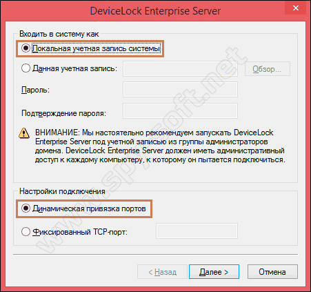

# Запрет USB с помощью DeviceLock DLP

Запрет USB — это конечно хорошо! А как насчет высоко функционального комплекса, который сможет контролировать и осуществлять аудит, как каждого пользователя, так и всей системы в целом? Именно этим комплексом и является DeviceLock DLP (DL).

Хочу напомнить, что у нас уже была статья на тему [запрета флешек](https://spy-soft.net/zapret-fleshek/). В ней мы рассматривали все остальные способы запрета использования USB. Если вам необходимо запретить использования USB, очень рекомендую!

### Запрет USB с помощью DeviceLock DLP

Средство очень функциональное и надежное. Для того чтобы описать все возможности и принципы работы, потребуется написать не одну статью. Однако, я постараюсь объяснить Вам вкратце принцип работы, расскажу о компонентах, установке и использовании.

Хотелось бы сразу сказать, что DL платный. Цена определяется в зависимости от нужных компонентов и количества узлов пользователей.

#### Принцип работы DeviceLock DLP

В общем то, все просто: это клиент-серверное программное обеспечения. Есть ПО для сервера и ПО для пользовательского узла. После установки на соответствующие компьютеры, администратор может управлять доступом к определенным устройствам клиентских компьютеров, создавая различные политики безопасности с помощью доступных компонентов.

При этом речь идет не просто о портах USB, дисководах и т.д. – осуществляется отслеживание данных через такие интерфейсы, как Wi-Fi, Bluetooth, LPT, COM и другие. Таким образом, администратор может отслеживать действия устройств, подключенных, например, через ActiveSyns или iTunes, принтеров, микрофонов, фотоаппаратов и т.д. Архив всех действий сохраняется в небольшой реляционной СУБД.

#### Компоненты DeviceLock DLP

Имеются 9 компонентов: 6 основных и 3 дополнительных. Ниже краткое описание каждого:

* DL Service – ПО на клиентах (пользовательских компьютерах). Осуществляет созданные сервером политики, ведет аудит.
* DL Enterprise Server – ПО на админ компьютерах. Занимается сбором информации со всех узлов и ее организацией.
* DL Management Console – осуществляет управление клиентами, индивидуально каждым.
* DL Enterprise Manager – позволяет осуществлять настройки на всех клиентах одновременно.
* DL Service Setting Editor – создает настройки и отдельные файлы с настройками для клиента. Кроме этого, с его помощью можно добавить к установочному (msi-файлу) клиента дополнительные настройки. Таким образом, при подключении к сети новых узлов можно будет установить клиент с уже встроенными настройками.
* DL GPO – позволяет встроить DL в интерфейс Active Directory. Позволяет редактировать и создавать новые политики в интеграции с DL.
* DL Content Security Server и DL Search Server. Первый, при индексации файлов в теневом хранилище, может добавлять в индекс значимое слово. Второй – осуществляет поиск по теневому хранилищу с учетом созданных индексов.
* DL Singing Tool – позволяет создавать коды-скрипты для изменения настроек или разблокировки клиентов отключенных от сети (оффлайн клиентов).

Собственно, все эти компоненты и составляют весь DeviceLock DLP. Хотелось бы добавить от себя, что функционал DL не просто обширный – он огромный. По моему мнению, в большинстве случаев использования не задействуется и половина возможностей.

Скачать пробную сборку можно с [официального сайта](https://www.devicelock.com/ru/). В ней есть не все компоненты, в отличии от полной платной сборки. Однако, так я смогу показать процесс установки, внешний вид и элементарные настройки.

.png>)

#### Установка DeviceLock DLP

Итак, запустите файл «setup.exe». Сразу же увидите небольшой слайд с описанием возможностей.

.png>)

И окно с инструкциями и предупреждениями.

.png>)

Далее прочитайте условия лицензионного соглашения и примите их.

.png>)

Сначала нужно установить именно указанный комплект. Если установить первоначально серверную часть, то потом невозможно установить клиентскую часть. Видимо все же продукт на рынке больше позиционируется как средство для администрирования доменных сетей.

.png>)

Затем нажимаем «Установить».

.png>)

Как видите, процесс установки пошел.

Во время установки создайте новый сертификат.

.png>)

Теперь выберите первоначальные настройки. Пункты, отмечены по умолчанию. Если хотите, можете добавить свои или убрать галочку с ненужных.

.png>)

Установка клиентской части завершена.

.png>)

Теперь переходим к серверной. Все также, только выберите уже этот пункт.

.png>)

В ходе процесса установки, выберите, каким образом будете входить в систему. Я выбрал локальную учетную запись по причине того, что устанавливаю комплекс на один компьютер. Если у Вас имеется сервер и клиентские рабочие станции, то нужно указать учетную запись сервера.

Также я выбрал стандартные настройки портов. Для связи с клиентами серверная часть использует порт 9133, однако если у Вас в системе он уже используется, можете выбрать другой (зафиксировать его за сервером).

Также укажите место хранения информации. В моем случае, это локальный компьютер и SQL Server. Да, вы правильно поняли, он должен быть на компьютере хотя бы локально.

.png>)

Все, установка завершится также, как и в клиентской части.

#### Запрет USB накопителей

Клиент я установил на этот ПК вместе с сервером. Поэтому мы можем осуществить запрет USB-накопителей.

Первое, что нужно сделать – просканировать установленный сервис на DL Enterprise Manager. Откройте его, выберите в списке узлов свой ПК и пункт «Установить сервис». Нажмите «Сканировать».

.png>)

Точно также можно сделать и с другим ПК в сети (LAN, WAN). При этом на него будет установлен клиент DL автоматически.

Теперь открываем DL Service Setting Editor. Заходим в показанный раздел и выбираем пункт USB-порт.

.png>)

Нужно добавить пользователя, которому будет запрещен доступ. Можно также запретить доступ всем кроме администратора.

.png>)

Находим этого пользователя.

.png>)

Далее жмем «ОК».

Здесь мы можем почасово настроить доступ каждого пользователя. Согласитесь, это крайне удобно. При этом настраиваются также права пользователя на различные действия.

Также бы можете создать белый список.

.png>)

Далее выберите настройки безопасности. Вот здесь можно решить проблему с другими устройствами, которым нужен USB-порт.

.png>)

Сделайте то же самое и для оффлайн режима.

.png>)

Можете выходить и сохраните настройки.

Теперь еще раз заходим в DL Enterprise Manager и опять на свой же ПК, выбираем «Установить настройки сервиса».

.png>)

Появится окно, где Вам нужно загрузить ранее созданные настройки. Затем нажмите «Сканировать».

.png>)

Все теперь настройки, созданные Вами, действуют для выбранного пользователя.

.png>)

### Запрет USB: выводы

После этой и предыдущей статьи, Вы убедились, что запрет USB можно осуществить различными методами. Первый вопрос, который вы мне можете задать – какой из них лучше?

Так вот, системные средства понятны и просты, однако довольно уязвимы. DeviceLock далеко не прост, платный, но очень функционален и хорошо защищен. Я бы сказал, что DL скорее подходит для администрирования доменных сетей, а остальные для ранжирования групп пользователей на одном ПК.

Вы спросите, чем же лучше этот сложный DL тех простых и понятных системных средств? Ответ однозначный: огромный спектр настроек, несколько уровней защиты и удобный интерфейс для администрирования доменных сетей.

Еще по теме: [История подключения флешек](https://spy-soft.net/istoriya-usb-podklyuchenij/)
